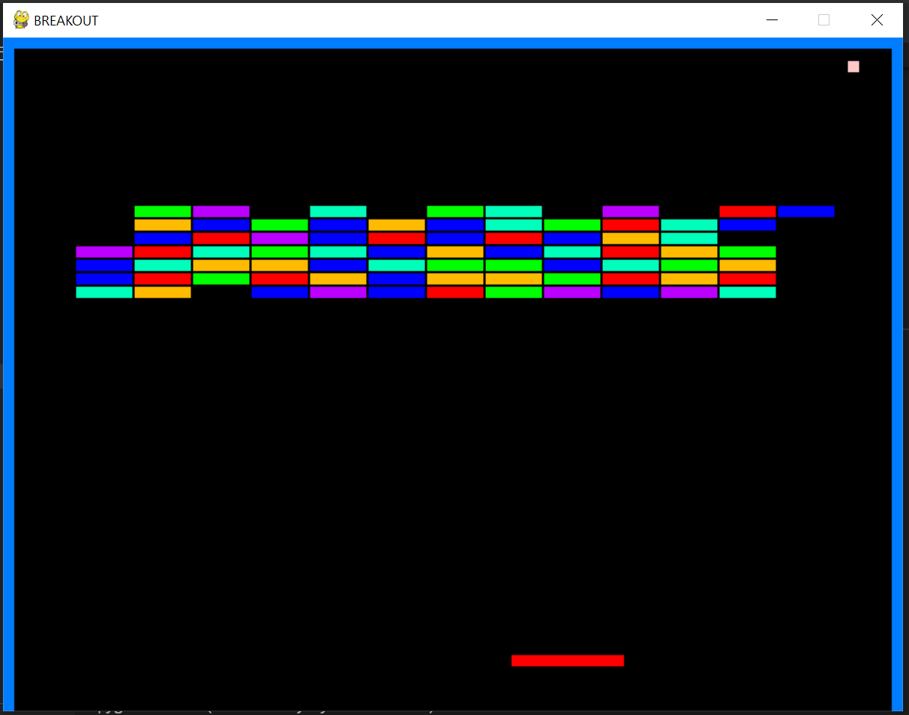

# 4160-Project1-BreakOut
The goal of this assignment is to build a basic game in Python using the Pygame library. This assignment will help you gain a deeper understanding of game development, game loops, game models, game views, and game controllers.

**PROGRAM VERSIONS:**
Windows 10
Python 3.10
Pygame 1.9.6

**GAME IMAGE:**

**MOTIVATION:**

My motivation for designing breakout rather than a simple pong game is quite simple really. It deals with more enitities than pong. Pong really does not have that many objects. Plus, I am doing this assignment alone, so it makes sense that I would make a single player game. I also just think BreakOut is more fun than Pong

**REASONING:**

So my game structure is simple, but it can look complicated at first look. First, we have the models. The models consist of every entity and it's position and properties like color and speed. For example, I have a paddle file that contains data about the paddles's position, color, Rect, and speed. This is done for the ball as well. The Walls are tiny bit different since there are mulitple walls. The blocks itself is even more extreme since there are so many. I made a brick class and made multiple bricks in a pack. This is to save space and time. Next is the view, which uses data from the model to draw content on the screen. It does not directly communicate with the model, but does use information like position and color. The view is repossible for drawing everything on the screen. The Controller like its name controls everything. Keyboard input and collison detection is executed here. Controller needs to call the models positions and also directly updates the view on model changes. The also put my main function in here which is called in the main.py file later. The reason I follow this particular format, is because of how it is executed. If I ever need to make a chnage to a particular model I know exactly where to look. This also applies for collison detection. If something is wrong with collison, I know I have to look in con
